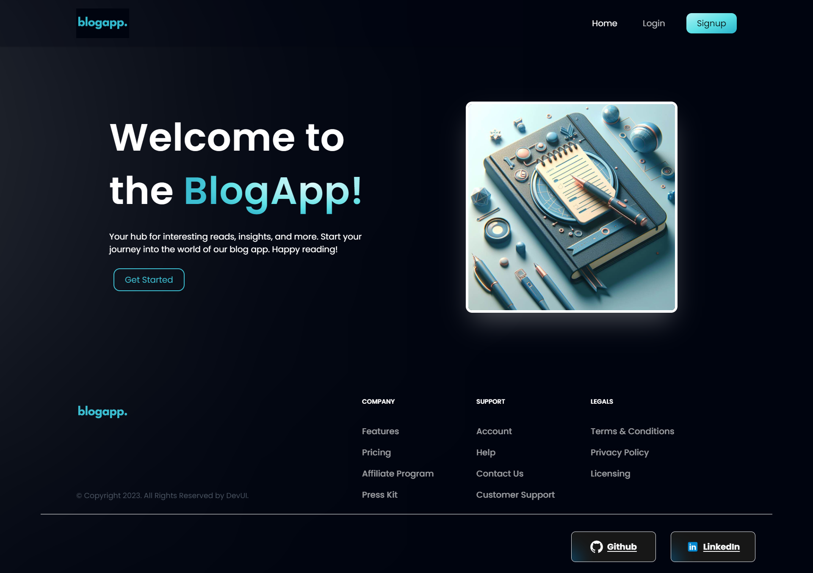
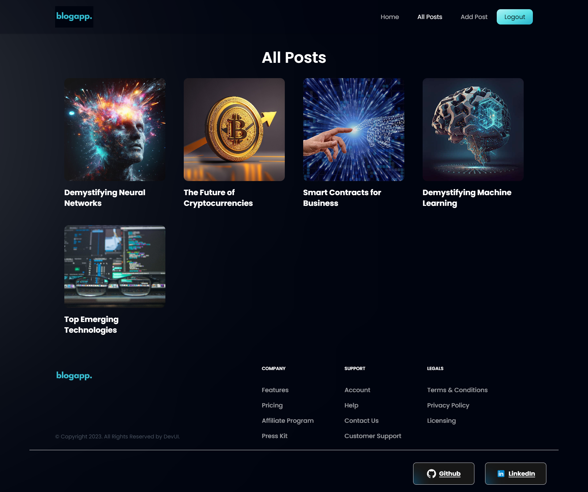

# BlogApp

BlogApp is a feature-rich web application that empowers users to share their thoughts and insights by publishing articles. Seamlessly integrating user authentication, a robust rich text editor, and Appwrite as the backend, BlogApp ensures a smooth and secure experience for both writers and readers.

--
## Features

- **User Authentication:** Secure signup and login using email.
- **Article Management:** Create, edit, and delete articles with ease.
- **Rich Text Editor:** Powered by TinyMCE, the editor offers a plethora of formatting options including font styles, colors, headings, indentations, images, tables, special characters, and numbering.
- **Browse Articles:** Users can explore a dedicated section to read and engage with articles posted by others.

## Technologies Used

- **React (Frontend):** A versatile JavaScript library for building user interfaces.
- **Tailwind CSS (Styling):** A utility-first CSS framework for efficient and responsive designs.
- **Appwrite (Backend):** An end-to-end backend server that simplifies backend tasks, providing secure user authentication and data storage.

## Dependencies

- **"@reduxjs/toolkit": "^2.0.1"**
- **"@tinymce/tinymce-react": "^4.3.2"**
- **"appwrite": "^13.0.1"**
- **"html-react-parser": "^5.1.1"**
- **"react": "^18.2.0"**
- **"react-dom": "^18.2.0"**
- **"react-hook-form": "^7.49.3"**
- **"react-redux": "^9.1.0"**
- **"react-router-dom": "^6.21.3"**

## Installation

1. **Clone the Repository:** `git clone https://github.com/shk-ubd/blog-app.git`
2. **Navigate to the Project Directory:** `cd blog-app`
3. **Install Dependencies:** `npm install`

## Usage

1. **Sign Up and Log In:** Create an account using your email and log in to access the full suite of features.
2. **Create and Manage Articles:** Navigate to "Add Post" in the navbar to publish a post. Edit or delete your articles as needed.
3. **Explore All Posts:** Visit the "All Posts" section to discover articles published by other users.

## Rich Text Editor

The application leverages TinyMCE, providing an intuitive and powerful rich text editing experience. Users can format text, insert multimedia elements, and craft engaging articles akin to professional word processors.

## Appwrite Integration

Appwrite serves as the backbone, streamlining backend operations and enhancing the security of user authentication and data storage. Appwrite abstracts the complexity and repetitiveness required to build a modern backend API, allowing developers to build secure apps faster.
## Deployment

BlogApp is live on [Netlify](https://shk-ubd-blogapp.netlify.app/), providing a convenient platform for users to experience the application.

## Contact Information

- **GitHub:** [shk-ubd](https://github.com/shk-ubd)
- **LinkedIn:** [Sheikh Ubaid Ullah](https://www.linkedin.com/in/sheikh-ubaid/)
